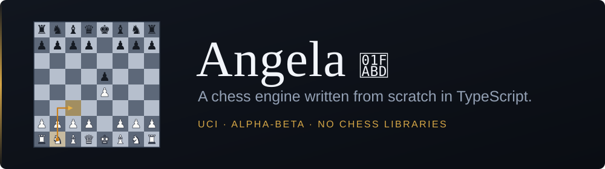

<p align="center">
  
</p>

A chess engine written from scratch in TypeScript. It speaks [UCI](https://backscattering.de/chess/uci/), so it plugs into any standard GUI (Arena, Cute Chess, BanksiaGUI), and it also ships a playable terminal interface.

**Play against it on Lichess: [@Angela_eng](https://lichess.org/@/Angela_eng).**

No chess libraries are used: move generation, legality, notation, search and evaluation are all implemented here.

## Requirements

Node.js (developed and tested on v24). Install dependencies with `npm install`.

## Running

**As a UCI engine.** Build once, then point your GUI at the wrapper script:

```
npm run build
```

| platform | engine path |
| --- | --- |
| Windows | `uci.bat` |
| Linux, macOS | `uci.sh` |

The build emits a self-contained `dist/`, so the wrapper is all the GUI needs. To run UCI straight from source without building, use `npm run uci`.

**In the terminal.** `npm start` opens a menu with two modes: play against the engine, or two players on the same board. Moves are entered in algebraic notation (`e4`, `Nf3`, `exd5`, `O-O`, `e8=Q`).

The engine picks the mode automatically: with a TTY attached it starts the terminal interface, otherwise it speaks UCI. `--uci` forces the protocol.

## UCI options

| option | type | default | meaning |
| --- | --- | --- | --- |
| `Hash` | spin, 1–1024 | 128 | transposition table size in MB |
| `OwnBook` | check | false | play from the built-in opening book |

Supported commands: `uci`, `isready`, `ucinewgame`, `setoption`, `position` (`startpos` or `fen`, with `moves`), `go`, `quit`. `go` accepts `wtime`, `btime`, `winc`, `binc`, `movestogo`, `movetime` and `depth`. Pondering and `MultiPV` are not implemented.

## What is inside

**Search** — iterative deepening over a negamax alpha-beta, with:

- transposition table keyed by incremental Zobrist hash, with mate scores stored relative to the root
- move ordering: hash move, then MVV-LVA for captures and promotions, then two killer slots per ply, then a history heuristic
- late move reduction, disabled for checks, captures and promotions
- quiescence search over captures and promotions, with delta pruning
- draw detection inside the tree: the fifty-move rule and a repeated position both score as 0. One repetition is enough to cut the branch, which is the usual search shortcut; the threefold rule proper is what ends a real game

**Evaluation** — material, piece-square tables, mobility for knights, bishops and rooks (squares defended by enemy pawns do not count), passed pawns with a separate and heavier table for the endgame, and a king table that switches in the endgame. Results are memoized in a hash-indexed cache.

**Time management** — the budget comes from the clock and the increment, scaled by the phase of the game, and capped both as a fraction of the clock and by a floor that the engine never spends into. Between iterations a soft limit stops the search rather than starting a depth it cannot finish.

**Opening book** — 5208 positions, built from master games (Elo 2200 and up, no bullet). Off by default; enable with `OwnBook`.

## Layout

```
src/
  core/
    chess/         rules: board, pieces, legality, notation
    engine/        how it thinks: search, evaluation, book, clock
  application/     use cases: game flow, UCI session
  presentation/    terminal interface and UCI protocol output
```

The dependency arrow points inward: `chess` knows nothing about `engine`, and `core` knows nothing about the layers above it. Nothing prints directly either — all output goes through a view object, which is what keeps stray lines out of the UCI stream.

## Tests

| command | what it checks |
| --- | --- |
| `npm run perft` | move generation against known node counts |
| `npm run check` | checkmate, stalemate, the fifty-move rule, repetition, insufficient material |
| `npm run zobrist` | incremental hash matches a hash computed from scratch |
| `npm run eval` | evaluation is color-symmetric and free of state between calls |
| `npm run search` | search respects its time budget and leaves the board untouched |
| `npm run uci:test` | protocol conformance, including that no line falls outside it |

Two more tools are benchmarks rather than tests. `npm run opt` measures what delta pruning and the evaluation cache cost and save. `npm run match` plays two builds against each other over UCI and reports the score with an Elo estimate and a confidence interval:

```
npm run match -- --a dist_new --b dist_old --movetime 200 --games 120
```

Separate processes are used on purpose: the table, killers and history are static, so in one process the second engine would inherit the first one's work.

## Building the opening book

```
npx ts-node scripts/buildBook.ts games.pgn src/core/engine/opening-book.json
```

The script reads a PGN and records how each move scored, keeping the first ten plies of games between players rated 2200 or higher, at slower than bullet, and only positions seen in at least twenty games. Plies, minimum games and a cap on games read are trailing arguments, in that order; the Elo and time-control floors are constants at the top of the script.
